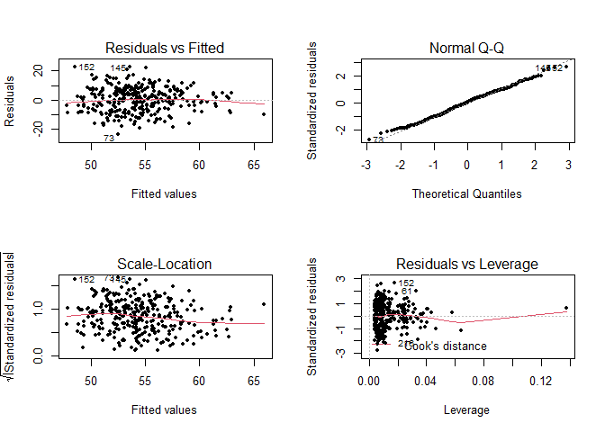

**P-Value Concept**

Using Heart Disease UCI Data Set
:<https://www.kaggle.com/ronitf/heart-disease-uci>

    ## 
    ## -- Column specification --------------------------------------------------------
    ## cols(
    ##   age = col_double(),
    ##   sex = col_double(),
    ##   cp = col_double(),
    ##   trestbps = col_double(),
    ##   chol = col_double(),
    ##   fbs = col_double(),
    ##   restecg = col_double(),
    ##   thalach = col_double(),
    ##   exang = col_double(),
    ##   oldpeak = col_double(),
    ##   slope = col_double(),
    ##   ca = col_double(),
    ##   thal = col_double(),
    ##   target = col_double()
    ## )

**Simple Regression**

    ## 
    ## Call:
    ## lm(formula = age ~ chol + trestbps + fbs, data = Heart)
    ## 
    ## Residuals:
    ##     Min      1Q  Median      3Q     Max 
    ## -23.522  -6.156   0.375   6.053  22.507 
    ## 
    ## Coefficients:
    ##             Estimate Std. Error t value Pr(>|t|)    
    ## (Intercept) 29.60494    4.21865   7.018 1.52e-11 ***
    ## chol         0.03201    0.00960   3.335 0.000962 ***
    ## trestbps     0.12605    0.02883   4.373 1.70e-05 ***
    ## fbs          1.92927    1.40865   1.370 0.171845    
    ## ---
    ## Signif. codes:  0 '***' 0.001 '**' 0.01 '*' 0.05 '.' 0.1 ' ' 1
    ## 
    ## Residual standard error: 8.581 on 299 degrees of freedom
    ## Multiple R-squared:  0.1162, Adjusted R-squared:  0.1073 
    ## F-statistic: 13.11 on 3 and 299 DF,  p-value: 4.602e-08

<!-- -->

Normal Q-Q above indicating that quantiles come from a Normal
Distribution as our data are almost on a line.

*chol* & *trestbps* have P-Values close to zero which means they are
playing a key role in connection with age. Technically, it means they
are statistically significant, **but Come OOOOn, what it meeeeans?!**

If you are like that, we are on the same page. I hate those conceptual
things that bring nothing but more complexity to the issue. Personally,
I love simple examples, kinda story ones that give us the simple concept
behind the scene. So, let’s go for it with an example. I hope you find
it useful.

Imagine we have a friend named Jimmy. He goes to a specific bar with his
friends every Friday night and they drink a lot! He goes to the bat
other nights too, but occasionally.

The bar owner asks us to find out if **Jimmy** is playing a **key role**
in increasing their **profit**!

When we analyzing the data, we make a distribution of revenue based on
the number of drinks. We find out because of Jimmy, they make much more
money on Friday nights. The bar owner tells us that he sometimes sees
Jimmy on other nights too, so, would you tell me if having Jimmy on
other nights is important or not?

When we look at our analysis, we came to an understanding that **Jimmy’s
roles are not that important on other nights**. We are gonna say "Sir,
as there is a slight chance that you can find Jimmy here at other
nights, but because of Friday nights, he is real a moneymaker!

So, Jimmy is playing a key role in the bar’s profit even if you consider
other nights too! It is not by chance that Jimmy brings more money for
the bar, despite the fact that we cannot see him on other nights. It
means **P-Value for Jimmy would be close to zero for Friday nights** and
he plays a key role in making more money for the bar.

We can make a Normal Distribution of Jimmy’s presence at the bar. Friday
nights would be at the middle. When we do simple regression for Profit
vs Jimmy on Friday nights, his P-value would be close to zero as it
means this is not just a luck that he increases the bar’s profit.

Is it a good example or what?!
